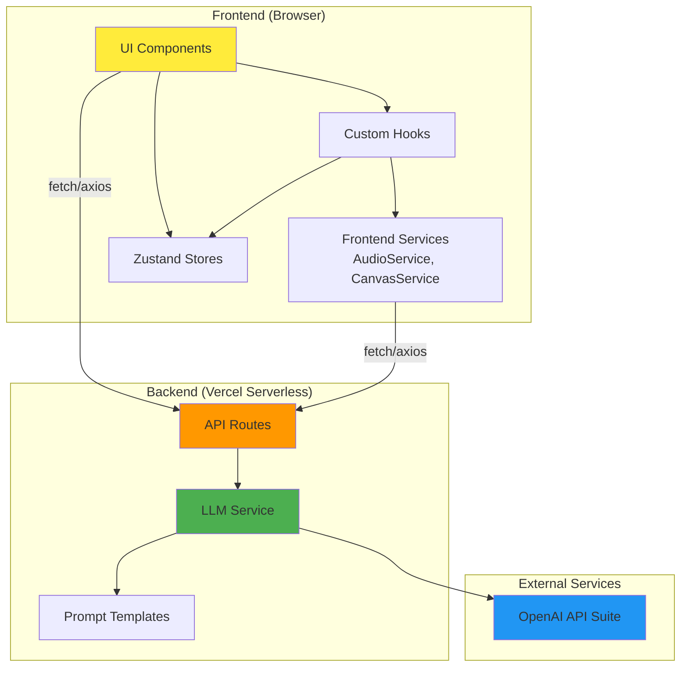
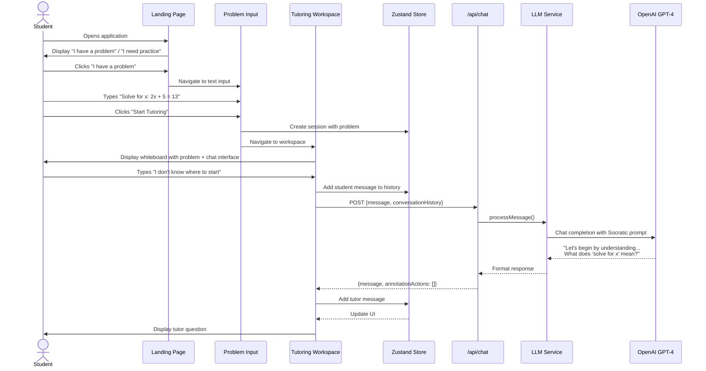
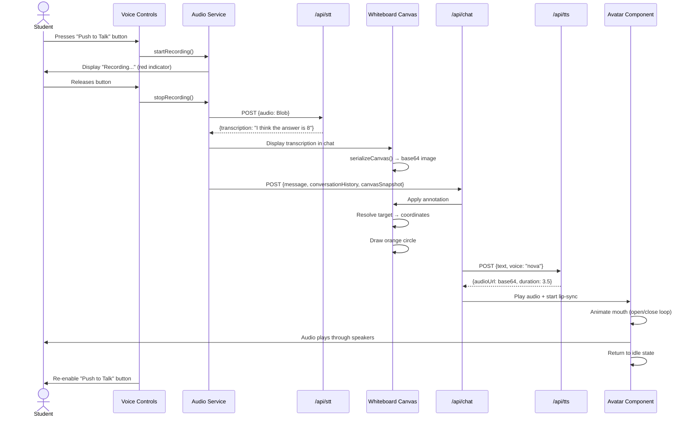

# AI Math Tutor Fullstack Architecture Document

**Version:** 1.0
**Date:** November 3, 2025
**Author:** Winston (Architect)
**Status:** In Progress (60% Complete)

---

## Table of Contents

1. [Introduction](#introduction)
2. [High Level Architecture](#high-level-architecture)
3. [Tech Stack](#tech-stack)
4. [Data Models](#data-models)
5. [API Specification](#api-specification)
6. [Components](#components)
7. [External APIs](#external-apis)
8. [Core Workflows](#core-workflows)
9. [Database Schema](#database-schema)
10. [Frontend Architecture](#frontend-architecture)
11. [Backend Architecture](#backend-architecture)
12. [Unified Project Structure](#unified-project-structure)

---

## Introduction

This document outlines the complete fullstack architecture for **AI Math Tutor**, including backend systems, frontend implementation, and their integration. It serves as the single source of truth for AI-driven development, ensuring consistency across the entire technology stack.

This unified approach combines what would traditionally be separate backend and frontend architecture documents, streamlining the development process for modern fullstack applications where these concerns are increasingly intertwined.

The AI Math Tutor is a **serverless monolithic Next.js application** that leverages Next.js API Routes as the backend layer, eliminating the need for separate backend infrastructure. All AI capabilities (dialogue, vision, voice) are orchestrated through server-side API routes that interact with OpenAI's suite of APIs.

### Starter Template or Existing Project

**Assessment:** This is a **greenfield project** with no existing starter template specified in the PRD.

**Recommendation:** Using the official Next.js template (`npx create-next-app@latest` with TypeScript + Tailwind) for fastest path to working foundation with zero configuration conflicts.

### Change Log

| Date | Version | Description | Author |
|------|---------|-------------|--------|
| 2025-11-03 | 1.0 | Initial architecture document creation | Winston (Architect) |

---

## High Level Architecture

### Technical Summary

The AI Math Tutor is a **serverless-first, monolithic Next.js 14 application** deployed on Vercel, utilizing Next.js API Routes as the exclusive backend layer. The frontend leverages React 18 with TypeScript for type-safe component development and Tailwind CSS for rapid UI styling. The backend orchestrates all AI capabilities through OpenAI's unified API suite: GPT-4 for Socratic dialogue, GPT-4 Vision for OCR, Whisper for speech-to-text, and TTS for voice synthesis.

The architecture is **stateless by design**—no database, no session persistence, no user authentication—enabling zero-infrastructure overhead while meeting the 5-7 day delivery timeline. All application state lives client-side (React Context or Zustand), with server-side API routes acting as thin orchestration layers for OpenAI API calls. The interactive whiteboard uses HTML5 Canvas API (or lightweight library like Konva.js) for drawing and annotation, with canvas state serialized to base64 images sent to GPT-4 Vision for visual context understanding.

This architecture achieves the PRD goals by prioritizing **speed of development**, **minimal operational complexity**, and **portfolio demonstration quality** over production-scale concerns like data persistence, user management, or multi-tenancy.

### Platform and Infrastructure Choice

**Selected Platform:** Vercel
**Key Services:**
- **Frontend Hosting:** Vercel Edge Network (CDN + static hosting)
- **Backend:** Vercel Serverless Functions (Next.js API Routes)
- **AI Services:** OpenAI API (GPT-4, GPT-4 Vision, Whisper, TTS)
- **Deployment:** Vercel Git Integration (auto-deploy from `main` branch)

**Deployment Host and Regions:** Global edge network (automatic), primary compute in US-East (Vercel default)

### Repository Structure

**Structure:** Monorepo (single repository)
**Monorepo Tool:** Native Next.js structure (no external tool needed)
**Package Organization:** Flat structure with clear separation of concerns

**Rationale:** PRD explicitly specifies "Monorepo" with Next.js API routes co-located. No need for Turborepo/Nx for single-app project (YAGNI principle). Shared TypeScript types live in `src/types/` (accessible to both frontend and API routes).

### High Level Architecture Diagram

```mermaid
graph TB
    User[Student User<br/>Browser: Chrome/Safari/Firefox]

    subgraph "Vercel Edge Network"
        CDN[CDN + Static Assets]
        NextApp[Next.js Application<br/>React Frontend]
    end

    subgraph "Vercel Serverless Functions"
        APIChat[/api/chat<br/>Socratic Dialogue]
        APIParseImage[/api/parse-image<br/>OCR Processing]
        APIGenerate[/api/generate-problem<br/>Practice Problems]
        APITTS[/api/tts<br/>Text-to-Speech]
        APISTT[/api/stt<br/>Speech-to-Text]
    end

    subgraph "External Services"
        OpenAI[OpenAI API Suite]
        GPT4[GPT-4<br/>Dialogue Engine]
        Vision[GPT-4 Vision<br/>Image OCR]
        Whisper[Whisper API<br/>Voice → Text]
        TTS[TTS API<br/>Text → Voice]
    end

    User -->|HTTPS| CDN
    CDN --> NextApp
    NextApp -->|API Calls| APIChat
    NextApp -->|Upload Image| APIParseImage
    NextApp -->|Request Practice| APIGenerate
    NextApp -->|Voice Input| APISTT
    NextApp -->|Tutor Response| APITTS

    APIChat -->|Conversation + Canvas| GPT4
    APIParseImage -->|Image| Vision
    APIGenerate -->|Topic| GPT4
    APISTT -->|Audio| Whisper
    APITTS -->|Text| TTS

    GPT4 --> OpenAI
    Vision --> OpenAI
    Whisper --> OpenAI
    TTS --> OpenAI

    style User fill:#e1f5ff
    style NextApp fill:#ffeb3b
    style OpenAI fill:#4caf50
    style CDN fill:#ff9800
```

### Architectural Patterns

- **Jamstack Architecture:** Static-first frontend with serverless API functions - _Rationale:_ Optimal performance for interactive UI while keeping backend logic isolated and stateless

- **Serverless Functions Pattern:** Each API route is an independent serverless function - _Rationale:_ Auto-scaling, zero infrastructure management, pay-per-request cost model ideal for demo/portfolio

- **Component-Based UI:** Reusable React components with TypeScript - _Rationale:_ Maintainability and type safety across large codebase; aligns with PRD requirement for clean architecture

- **Service Layer Pattern:** Business logic abstracted into service modules (llmService, canvasService, audioService) - _Rationale:_ API routes remain thin orchestration layers; services are testable in isolation

- **Stateless Session Pattern:** No server-side session storage; all state managed client-side - _Rationale:_ PRD explicitly states "no user authentication" and "stateless sessions"; eliminates database requirement

- **API Gateway Pattern (Implicit):** Next.js API routes act as unified API layer - _Rationale:_ Single entry point for OpenAI API calls; centralizes error handling, rate limiting, and API key management

- **Canvas Serialization Pattern:** Visual state captured as base64 images for LLM context - _Rationale:_ GPT-4 Vision requires image input; serialization enables "visual understanding" of student work

---

## Tech Stack

This is the **DEFINITIVE** technology selection for the entire AI Math Tutor project. All development must use these exact technologies and versions.

### Technology Stack Table

| Category | Technology | Version | Purpose | Rationale |
|----------|-----------|---------|---------|-----------|
| **Frontend Language** | TypeScript | 5.3+ | Type-safe frontend development | PRD requirement for type safety; prevents runtime errors in canvas/state management logic |
| **Frontend Framework** | Next.js | 14.2+ | React framework with App Router + API Routes | PRD explicit requirement; provides both frontend and serverless backend in single framework |
| **UI Component Library** | Headless UI | 2.0+ | Accessible, unstyled components | Lightweight, pairs with Tailwind, provides keyboard navigation for accessibility (PRD NFR8) |
| **State Management** | Zustand | 4.5+ | Lightweight client state | Simpler than Redux, <1KB, sufficient for conversation history + canvas state; no learning curve overhead |
| **Backend Language** | TypeScript | 5.3+ | Type-safe API route development | Same language across stack; shared types between frontend/backend in `src/types/` |
| **Backend Framework** | Next.js API Routes | 14.2+ | Serverless API endpoints | Built-in to Next.js; zero additional setup; auto-deployed as Vercel serverless functions |
| **API Style** | REST | N/A | HTTP JSON APIs | Simplest approach for OpenAI API proxying; no GraphQL/tRPC overhead needed for 5 endpoints |
| **Database** | None (Stateless) | N/A | No persistence layer | PRD explicitly stateless MVP; eliminates setup/migration time |
| **Cache** | None | N/A | No caching layer | Stateless sessions; OpenAI responses are non-deterministic (no cache benefit) |
| **File Storage** | Vercel Blob Storage | N/A | Temporary image uploads (OCR) | Optional; may use in-memory base64 encoding instead; evaluate in Epic 2 |
| **Authentication** | None | N/A | No user accounts | PRD explicitly states "no user authentication or account creation for MVP" |
| **Frontend Testing** | Jest + React Testing Library | 29+ / 14+ | Unit tests for critical utilities | PRD allows "selective unit tests"; focus on canvas serialization, LaTeX parsing |
| **Backend Testing** | Jest | 29+ | Unit tests for API services | Test LLM service with mocked OpenAI responses; validate prompt engineering |
| **E2E Testing** | Manual QA | N/A | Cross-browser validation | PRD prioritizes manual testing over E2E automation for 5-7 day timeline |
| **Build Tool** | npm | 10+ | Package management | Default Node.js tooling; no additional setup |
| **Bundler** | Webpack (via Next.js) | 5+ | Asset bundling | Built-in to Next.js; zero configuration needed |
| **IaC Tool** | None | N/A | No infrastructure as code | Vercel manages all infrastructure; no Terraform/CDK needed |
| **CI/CD** | Vercel Git Integration | N/A | Automatic deployments from main | Zero-config CI/CD; auto-deploys on push to main branch |
| **Monitoring** | Vercel Analytics | N/A | Performance monitoring | Free tier; tracks Core Web Vitals, function execution times |
| **Logging** | Vercel Logs | N/A | Serverless function logs | Built-in; accessible via Vercel dashboard; sufficient for demo/portfolio |
| **CSS Framework** | Tailwind CSS | 3.4+ | Utility-first styling | PRD explicit requirement; rapid prototyping, responsive design utilities |
| **Math Rendering** | KaTeX | 0.16+ | LaTeX mathematical notation | PRD explicit requirement; lightweight (<100KB), renders fractions/exponents/symbols |
| **Canvas Library** | Konva.js | 9.3+ | HTML5 Canvas abstraction | Simpler API than Fabric.js; better performance; supports touch + mouse; ~200KB bundle |
| **Voice (STT)** | OpenAI Whisper API | V1 | Speech-to-text transcription | PRD requirement; server-side processing via `/api/stt` endpoint |
| **Voice (TTS)** | OpenAI TTS API | V1 | Text-to-speech synthesis | PRD requirement; voice recommendation: "nova" or "alloy" (friendly, educational tone) |
| **LLM** | OpenAI GPT-4 | gpt-4-turbo | Socratic dialogue engine | PRD requirement; sufficient context window for conversation history + canvas images |
| **Vision** | OpenAI GPT-4 Vision | gpt-4-vision-preview | Image OCR parsing | PRD requirement; handles both handwritten and printed math notation |
| **Linting** | ESLint | 8.57+ | Code quality enforcement | Next.js default config; enforce TypeScript strict mode |
| **Formatting** | Prettier | 3.2+ | Code formatting | Consistent style across codebase; integrates with ESLint |
| **Git Hooks** | Husky | 9.0+ | Pre-commit hooks | Run Gitleaks secret scanning before commits (Story 1.2) |
| **Secret Scanning** | Gitleaks | 8.18+ | API key leak prevention | PRD requirement (Greptile → Gitleaks); blocks commits containing secrets |

---

## Data Models

The AI Math Tutor is **stateless with no database persistence**. However, well-defined data models provide type safety across frontend and backend (shared TypeScript interfaces), API contract definitions, conversation state management, and canvas serialization for LLM context.

These models live in `src/types/` and are imported by both frontend components and API routes.

### ConversationMessage

**Purpose:** Represents a single message in the tutoring conversation between student and tutor. Used in conversation history state and passed to GPT-4 for context.

**Key Attributes:**
- `id`: string - Unique identifier for the message (UUID or timestamp-based)
- `role`: 'student' | 'tutor' | 'system' - Sender of the message
- `content`: string - The text content of the message
- `timestamp`: Date - When the message was created
- `metadata`: MessageMetadata (optional) - Additional context (canvas snapshot, audio duration, etc.)

#### TypeScript Interface

```typescript
interface ConversationMessage {
  id: string;
  role: 'student' | 'tutor' | 'system';
  content: string;
  timestamp: Date;
  metadata?: MessageMetadata;
}

interface MessageMetadata {
  canvasSnapshot?: string; // base64 encoded image
  audioUrl?: string; // TTS audio URL (if voice enabled)
  annotationActions?: CanvasAnnotation[]; // Tutor visual actions
}
```

#### Relationships
- **Many-to-One** with `TutoringSession` (a session contains multiple messages)
- **One-to-Many** with `CanvasAnnotation` (a tutor message may trigger multiple annotations)

### TutoringSession

**Purpose:** Represents the complete state of a single tutoring session, including the problem being worked on, conversation history, and canvas state. This is the primary client-side state object.

**Key Attributes:**
- `sessionId`: string - Unique session identifier
- `problem`: MathProblem - The current problem being worked on
- `messages`: ConversationMessage[] - Complete conversation history
- `canvasState`: CanvasState - Current state of the whiteboard
- `status`: 'active' | 'completed' | 'abandoned' - Session lifecycle status
- `startedAt`: Date - When the session began
- `completedAt`: Date (optional) - When the problem was solved

#### TypeScript Interface

```typescript
interface TutoringSession {
  sessionId: string;
  problem: MathProblem;
  messages: ConversationMessage[];
  canvasState: CanvasState;
  status: 'active' | 'completed' | 'abandoned';
  startedAt: Date;
  completedAt?: Date;
}
```

#### Relationships
- **One-to-One** with `MathProblem` (each session works on one problem)
- **One-to-Many** with `ConversationMessage` (session contains conversation history)
- **One-to-One** with `CanvasState` (session has one active canvas)

### MathProblem

**Purpose:** Represents the mathematical problem being tutored, including its source (uploaded image, typed text, or generated practice problem) and rendered representation.

**Key Attributes:**
- `problemId`: string - Unique identifier
- `source`: 'text' | 'image' | 'generated' - How the problem was inputted
- `rawContent`: string - Original problem text or LaTeX notation
- `parsedContent`: string - Cleaned/parsed version for rendering (LaTeX format)
- `topic`: string (optional) - Subject area (e.g., "fractions", "algebra") for generated problems
- `imageUrl`: string (optional) - URL/base64 of uploaded image (if source is 'image')
- `difficulty`: 'easy' | 'medium' | 'hard' (optional) - For generated problems

#### TypeScript Interface

```typescript
interface MathProblem {
  problemId: string;
  source: 'text' | 'image' | 'generated';
  rawContent: string;
  parsedContent: string;
  topic?: string;
  imageUrl?: string;
  difficulty?: 'easy' | 'medium' | 'hard';
}
```

#### Relationships
- **One-to-One** with `TutoringSession` (problem is part of one session)

### CanvasState

**Purpose:** Represents the complete state of the interactive whiteboard, including the rendered problem, student drawings, and tutor annotations. Serialized for GPT-4 Vision context.

**Key Attributes:**
- `stageSize`: Dimensions - Width and height of the canvas
- `problemElements`: CanvasElement[] - Rendered problem components (LaTeX, text)
- `studentStrokes`: DrawingStroke[] - Student's drawing marks
- `tutorAnnotations`: CanvasAnnotation[] - Tutor's highlights/circles
- `semanticRegistry`: SemanticRegistry - Maps semantic IDs to canvas coordinates (e.g., "numerator_1" → {x, y, width, height})

#### TypeScript Interface

```typescript
interface CanvasState {
  stageSize: Dimensions;
  problemElements: CanvasElement[];
  studentStrokes: DrawingStroke[];
  tutorAnnotations: CanvasAnnotation[];
  semanticRegistry: SemanticRegistry;
}

interface Dimensions {
  width: number;
  height: number;
}

interface CanvasElement {
  id: string;
  type: 'text' | 'latex' | 'image';
  content: string;
  position: Position;
  style: ElementStyle;
}

interface DrawingStroke {
  id: string;
  points: number[]; // Konva.js format: [x1, y1, x2, y2, ...]
  color: string;
  strokeWidth: number;
  timestamp: Date;
}

interface CanvasAnnotation {
  id: string;
  type: 'highlight' | 'circle';
  targetId?: string; // Semantic ID from registry
  position: Position;
  size: Dimensions;
  color: string;
  createdAt: Date;
}

interface Position {
  x: number;
  y: number;
}

interface ElementStyle {
  fontSize?: number;
  fontFamily?: string;
  color?: string;
}

interface SemanticRegistry {
  [semanticId: string]: {
    position: Position;
    size: Dimensions;
    label: string; // Human-readable label (e.g., "numerator", "equals sign")
  };
}
```

#### Relationships
- **One-to-One** with `TutoringSession` (canvas is part of one session)
- **One-to-Many** with `CanvasAnnotation` (canvas contains multiple annotations)

### APIRequest / APIResponse

**Purpose:** Standard request/response contracts for all API routes. Ensures type safety between frontend and backend.

#### TypeScript Interfaces

```typescript
// Chat API (Socratic Dialogue)
interface ChatRequest {
  sessionId: string;
  message: string;
  conversationHistory: ConversationMessage[];
  canvasSnapshot?: string; // base64 image
}

interface ChatResponse {
  message: ConversationMessage;
  annotationActions?: AnnotationAction[]; // If tutor wants to highlight/circle
}

// Image Parsing API (OCR)
interface ParseImageRequest {
  image: string; // base64 encoded
}

interface ParseImageResponse {
  success: boolean;
  parsedContent: string; // LaTeX formatted problem
  confidence: number; // 0-1 scale
  error?: string;
}

// Generate Practice Problem API
interface GenerateProblemRequest {
  topic: string;
  difficulty?: 'easy' | 'medium' | 'hard';
}

interface GenerateProblemResponse {
  problem: MathProblem;
}

// Speech-to-Text API
interface STTRequest {
  audio: Blob | string; // Audio file or base64
}

interface STTResponse {
  transcription: string;
  duration: number; // seconds
}

// Text-to-Speech API
interface TTSRequest {
  text: string;
  voice?: 'alloy' | 'echo' | 'fable' | 'nova' | 'onyx' | 'shimmer';
}

interface TTSResponse {
  audioUrl: string; // Base64-encoded audio data
  duration: number; // seconds
}

// Annotation Action (from LLM function calling)
interface AnnotationAction {
  action: 'highlight' | 'circle';
  target: string; // Natural language description (e.g., "numerator", "left side")
}
```

---

## API Specification

The AI Math Tutor uses **REST API** endpoints implemented as Next.js API Routes. All endpoints are serverless functions deployed on Vercel, proxying requests to OpenAI APIs with server-side API key management.

### REST API Specification

```yaml
openapi: 3.0.0
info:
  title: AI Math Tutor API
  version: 1.0.0
  description: REST API for AI-powered Socratic math tutoring with multi-modal interaction
servers:
  - url: https://ai-math-tutor.vercel.app/api
    description: Production (Vercel)
  - url: http://localhost:3000/api
    description: Local Development

paths:
  /chat:
    post:
      summary: Send student message and receive Socratic tutor response
      description: |
        Processes student input (text or transcribed voice) along with conversation history
        and optional canvas snapshot. Returns tutor's guiding question/response and any
        canvas annotation actions.
      requestBody:
        required: true
        content:
          application/json:
            schema:
              type: object
              required:
                - sessionId
                - message
                - conversationHistory
              properties:
                sessionId:
                  type: string
                  description: Unique session identifier (UUID)
                  example: "550e8400-e29b-41d4-a716-446655440000"
                message:
                  type: string
                  description: Student's input message
                  example: "I think the answer is 8"
                conversationHistory:
                  type: array
                  items:
                    $ref: '#/components/schemas/ConversationMessage'
                  description: Complete conversation history for context
                canvasSnapshot:
                  type: string
                  format: byte
                  description: Base64-encoded PNG of current canvas state (optional)
      responses:
        '200':
          description: Successful tutor response
          content:
            application/json:
              schema:
                type: object
                properties:
                  message:
                    $ref: '#/components/schemas/ConversationMessage'
                  annotationActions:
                    type: array
                    items:
                      $ref: '#/components/schemas/AnnotationAction'
        '400':
          $ref: '#/components/responses/BadRequest'
        '500':
          $ref: '#/components/responses/InternalError'

  /parse-image:
    post:
      summary: Parse uploaded math problem image using OCR
      description: |
        Accepts an uploaded image (handwritten or printed math problem) and uses
        GPT-4 Vision to extract the mathematical problem as LaTeX-formatted text.
      requestBody:
        required: true
        content:
          application/json:
            schema:
              type: object
              required:
                - image
              properties:
                image:
                  type: string
                  format: byte
                  description: Base64-encoded image (PNG, JPG, JPEG)
                  example: "data:image/png;base64,iVBORw0KGgoAAAANS..."
      responses:
        '200':
          description: Successfully parsed image
          content:
            application/json:
              schema:
                type: object
                properties:
                  success:
                    type: boolean
                    example: true
                  parsedContent:
                    type: string
                    description: Extracted problem in LaTeX format
                    example: "2x + 5 = 13"
                  confidence:
                    type: number
                    format: float
                    description: Parsing confidence (0-1)
                    example: 0.95
        '400':
          $ref: '#/components/responses/BadRequest'
        '500':
          $ref: '#/components/responses/InternalError'

  /generate-problem:
    post:
      summary: Generate practice problem on specified topic
      description: |
        Creates a grade-appropriate math problem for the requested topic using GPT-4.
        Returns problem as structured MathProblem object.
      requestBody:
        required: true
        content:
          application/json:
            schema:
              type: object
              required:
                - topic
              properties:
                topic:
                  type: string
                  description: Subject area for practice
                  example: "fractions"
                difficulty:
                  type: string
                  enum: [easy, medium, hard]
                  description: Optional difficulty level
                  example: "medium"
      responses:
        '200':
          description: Successfully generated problem
          content:
            application/json:
              schema:
                type: object
                properties:
                  problem:
                    $ref: '#/components/schemas/MathProblem'
        '400':
          $ref: '#/components/responses/BadRequest'
        '500':
          $ref: '#/components/responses/InternalError'

  /stt:
    post:
      summary: Convert speech audio to text
      description: |
        Transcribes student voice input using OpenAI Whisper API.
        Accepts audio in various formats (webm, mp3, wav).
      requestBody:
        required: true
        content:
          multipart/form-data:
            schema:
              type: object
              required:
                - audio
              properties:
                audio:
                  type: string
                  format: binary
                  description: Audio file from browser recording
      responses:
        '200':
          description: Successfully transcribed audio
          content:
            application/json:
              schema:
                type: object
                properties:
                  transcription:
                    type: string
                    example: "I think the answer is 8"
                  duration:
                    type: number
                    format: float
                    description: Audio duration in seconds
                    example: 2.3
        '400':
          $ref: '#/components/responses/BadRequest'
        '500':
          $ref: '#/components/responses/InternalError'

  /tts:
    post:
      summary: Convert text to speech audio
      description: |
        Generates spoken audio of tutor response using OpenAI TTS API.
        Returns base64-encoded audio data.
      requestBody:
        required: true
        content:
          application/json:
            schema:
              type: object
              required:
                - text
              properties:
                text:
                  type: string
                  description: Tutor's response text to speak
                  example: "That's not quite right. Let's think about what 2x means."
                voice:
                  type: string
                  enum: [alloy, echo, fable, nova, onyx, shimmer]
                  description: OpenAI TTS voice selection
                  default: nova
                  example: "nova"
      responses:
        '200':
          description: Successfully generated audio
          content:
            application/json:
              schema:
                type: object
                properties:
                  audioUrl:
                    type: string
                    description: Base64-encoded audio data (data:audio/mp3;base64,...)
                    example: "data:audio/mp3;base64,..."
                  duration:
                    type: number
                    format: float
                    description: Audio duration in seconds
                    example: 3.5
        '400':
          $ref: '#/components/responses/BadRequest'
        '500':
          $ref: '#/components/responses/InternalError'

components:
  schemas:
    ConversationMessage:
      type: object
      required:
        - id
        - role
        - content
        - timestamp
      properties:
        id:
          type: string
          example: "msg_123456"
        role:
          type: string
          enum: [student, tutor, system]
          example: "student"
        content:
          type: string
          example: "I think the answer is 8"
        timestamp:
          type: string
          format: date-time
          example: "2025-11-03T14:30:00Z"
        metadata:
          type: object
          properties:
            canvasSnapshot:
              type: string
              format: byte
            audioUrl:
              type: string
            annotationActions:
              type: array
              items:
                $ref: '#/components/schemas/AnnotationAction'

    MathProblem:
      type: object
      required:
        - problemId
        - source
        - rawContent
        - parsedContent
      properties:
        problemId:
          type: string
          example: "prob_789012"
        source:
          type: string
          enum: [text, image, generated]
          example: "text"
        rawContent:
          type: string
          example: "Solve for x: 2x + 5 = 13"
        parsedContent:
          type: string
          example: "2x + 5 = 13"
        topic:
          type: string
          example: "algebra"
        imageUrl:
          type: string
        difficulty:
          type: string
          enum: [easy, medium, hard]

    AnnotationAction:
      type: object
      required:
        - action
        - target
      properties:
        action:
          type: string
          enum: [highlight, circle]
          example: "highlight"
        target:
          type: string
          description: Natural language description of target element
          example: "the numerator"

    ApiError:
      type: object
      required:
        - error
      properties:
        error:
          type: object
          properties:
            code:
              type: string
              example: "INVALID_INPUT"
            message:
              type: string
              example: "Message field is required"
            details:
              type: object
            timestamp:
              type: string
              format: date-time
            requestId:
              type: string

  responses:
    BadRequest:
      description: Invalid request parameters
      content:
        application/json:
          schema:
            $ref: '#/components/schemas/ApiError'
    InternalError:
      description: Internal server error (OpenAI API failure, processing error)
      content:
        application/json:
          schema:
            $ref: '#/components/schemas/ApiError'
```

---

## Components

Based on the architectural patterns, tech stack, and data models, the AI Math Tutor system is organized into **logical components** that span both frontend (React components, hooks, services) and backend (API routes, business logic).

### Frontend Application (Next.js React)

**Responsibility:** User interface rendering, client-side state management, user interaction handling, and API consumption.

**Key Interfaces:**
- Renders tutoring workspace (conversation panel + whiteboard + avatar)
- Manages client state (conversation history, canvas state, UI state)
- Captures user input (text, voice, drawing, image upload)
- Consumes REST API endpoints (`/api/chat`, `/api/tts`, etc.)

**Dependencies:**
- Backend API Routes (via fetch/axios)
- External: Browser APIs (Web Speech API, Canvas API, File API)

**Technology Stack:**
- Next.js 14+ App Router (React 18)
- TypeScript for type safety
- Zustand for state management
- Tailwind CSS for styling
- Konva.js for canvas interaction

### API Orchestration Layer (Next.js API Routes)

**Responsibility:** Server-side request handling, input validation, OpenAI API orchestration, error handling, and response formatting.

**Key Interfaces:**
- Exposes REST endpoints: `/api/chat`, `/api/parse-image`, `/api/generate-problem`, `/api/stt`, `/api/tts`
- Validates incoming requests against TypeScript schemas
- Calls OpenAI APIs with server-side API key
- Formats responses according to API specification
- Handles errors and rate limiting

**Dependencies:**
- Business Logic Services (LLMService, CanvasService, AudioService)
- External: OpenAI API suite

**Technology Stack:**
- Next.js API Routes (serverless functions)
- TypeScript
- OpenAI Node.js SDK

### LLM Service (Socratic Dialogue Engine)

**Responsibility:** Manages all interactions with GPT-4 API for tutoring conversations, including prompt engineering, conversation context management, and function calling for canvas annotations.

**Key Interfaces:**
- `sendMessage(conversationHistory, canvasSnapshot?) → TutorResponse`
- `parseProblemImage(imageBase64) → ParsedProblem`
- `generatePracticeProblem(topic, difficulty?) → MathProblem`

**Dependencies:**
- OpenAI GPT-4 API
- Prompt templates (src/services/prompts.ts)
- Function calling definitions for canvas annotations

**Technology Stack:**
- OpenAI Node.js SDK
- TypeScript

#### Prompt Engineering Strategy

The prompts are the "pedagogical intelligence" of the system. They encode teaching methodology, behavioral guidelines, and adaptive scaffolding strategies that transform GPT-4 from a generic chatbot into a Socratic math tutor.

**Prompt Location:** `src/services/prompts.ts`

**Version Control:** All prompts are versioned (e.g., `SOCRATIC_TUTOR_SYSTEM_PROMPT_V1`) to enable A/B testing and iteration.

**Research-Backed Pedagogical Framework:**

1. **Vygotsky's Zone of Proximal Development (ZPD)** - Adaptive scaffolding with 4 escalation levels based on student progress
2. **NCTM's Productive Struggle Principles** - Validates confusion and errors as natural learning processes
3. **Socratic Questioning Framework** - Opening, guiding, and closing questions

**Behavioral Constraints:**
- Ask ONE question at a time
- Acknowledge incorrect answers explicitly
- Celebrate correct steps and partial progress
- Never provide direct answers or complete solutions
- Build incrementally on student's demonstrated understanding

**Visual Annotation Integration:** The prompt instructs GPT-4 to use `annotate_canvas` function sparingly when visual guidance is more effective than verbal.

**Response Format:** 1-3 sentences maximum, age-appropriate vocabulary (grades 3-8), warm conversational tone.

### Canvas Service (Whiteboard Management)

**Responsibility:** Handles canvas state serialization, semantic registry management, and coordinate resolution for tutor annotations.

**Key Interfaces:**
- `serializeCanvas(canvasState) → base64Image`
- `registerSemanticElement(id, boundingBox, label) → void`
- `resolveAnnotationTarget(target: string) → CanvasCoordinates | null`
- `applyAnnotation(action: AnnotationAction) → CanvasAnnotation | null`

**Technology Stack:**
- TypeScript
- Konva.js
- Fuzzy matching algorithm (for semantic target resolution)

**3-Tier Resolution Strategy:**
1. **Semantic Match:** "numerator" → semantic registry lookup
2. **Region Match:** "left side" → predefined region coordinates
3. **Verbal Fallback:** If both fail, return null (tutor's verbal message still displays)

### Audio Service (Voice Interface)

**Responsibility:** Manages browser audio recording (speech-to-text) and playback (text-to-speech), including audio format conversion and error handling.

**Key Interfaces:**
- `startRecording() → void`
- `stopRecording() → AudioBlob`
- `transcribeAudio(audioBlob) → Promise<string>`
- `synthesizeSpeech(text, voice?) → Promise<AudioData>`
- `playAudio(audioData) → void`

**Technology Stack:**
- TypeScript
- Browser Web APIs (MediaRecorder, Audio)

### Component Diagrams



---

## External APIs

The AI Math Tutor integrates with **OpenAI's API suite** as the sole external service provider.

### OpenAI API

- **Purpose:** Provides all AI capabilities for the tutoring system
- **Documentation:** https://platform.openai.com/docs/api-reference
- **Base URL(s):**
  - `https://api.openai.com/v1/chat/completions` (GPT-4, GPT-4 Vision)
  - `https://api.openai.com/v1/audio/transcriptions` (Whisper STT)
  - `https://api.openai.com/v1/audio/speech` (TTS)
- **Authentication:** Bearer token (API key stored in `OPENAI_API_KEY` environment variable)
- **Rate Limits:** Tier 1+ recommended (3,500 requests/minute, 10,000 requests/day)
- **Cost estimate:** $10-30 for development + demo (within PRD budget)

**Key Endpoints:**

1. **POST /v1/chat/completions** - Socratic Dialogue (with function calling for canvas annotations)
2. **POST /v1/chat/completions** - Image OCR (GPT-4 Vision with base64 images)
3. **POST /v1/audio/transcriptions** - Speech-to-Text (Whisper, supports webm/mp3/wav)
4. **POST /v1/audio/speech** - Text-to-Speech (TTS, voice: "nova" recommended)

---

## Core Workflows

This section illustrates critical system workflows using sequence diagrams.

### Workflow 1: Complete Tutoring Session (Text Input Path)



### Workflow 2: Voice Interaction with Canvas Annotation



---

## Database Schema

**Note:** The AI Math Tutor is architecturally **stateless with no database persistence** (PRD requirement). This eliminates ~6-10 hours of setup time and reduces operational complexity.

**Data Storage Strategy:**
- **Client-side:** All application state in Zustand stores
- **Server-side:** Stateless API routes (no session storage)
- **External:** No file storage (everything in-memory as base64)

**Post-MVP:** If persistence becomes a requirement, recommended approach is PostgreSQL via Supabase free tier with session/message/analytics tables.

---

## Frontend Architecture

The frontend is a Next.js 14+ React application using the App Router, organized into presentational and container components with Zustand for state management.

### Component Organization

```
src/components/
├── ui/                    # Base UI primitives
├── layout/                # Layout components
├── chat/                  # Chat interface
├── whiteboard/            # Canvas components
├── problem-input/         # Problem entry
├── avatar/                # Avatar components
└── voice/                 # Voice controls
```

### State Management Architecture

**Store 1: Tutoring Store** - Session + conversation history
**Store 2: Canvas Store** - Drawing state and annotations
**Store 3: UI Store** - Loading states, modals, settings

**Pattern:** Container/Presentational separation with Zustand selectors for derived state.

### Routing Architecture

```
app/
├── page.tsx              # Landing page (/)
├── problem-input/page.tsx # Problem input (/problem-input)
└── workspace/page.tsx     # Tutoring workspace (/workspace)
```

---

## Backend Architecture

The backend is implemented entirely through **Next.js API Routes**, providing serverless functions that orchestrate OpenAI API calls.

### Serverless Architecture: Function Organization

```
src/app/api/
├── chat/route.ts          # POST /api/chat
├── parse-image/route.ts   # POST /api/parse-image
├── generate-problem/route.ts
├── stt/route.ts
└── tts/route.ts
```

**Service Layer:**
- `llmService.ts` - GPT-4 interaction
- `audioService.ts` - Whisper STT + TTS orchestration
- `canvasService.ts` - Canvas annotation resolution
- `prompts.ts` - Prompt templates

**Pattern:** API routes are thin controllers (<50 lines), business logic in testable services.

---

## Unified Project Structure

```
ai-math-tutor/
├── .github/workflows/         # CI/CD
├── .husky/                    # Git hooks (Gitleaks pre-commit)
├── public/                    # Static assets (avatar images)
├── src/
│   ├── app/                   # Next.js App Router
│   │   ├── api/               # API Routes (serverless backend)
│   │   ├── problem-input/
│   │   └── workspace/
│   ├── components/            # React components
│   ├── hooks/                 # Custom React hooks
│   ├── services/              # Services (frontend + backend)
│   ├── lib/                   # Infrastructure (OpenAI client, error handler)
│   ├── stores/                # Zustand state stores
│   ├── types/                 # Shared TypeScript types
│   └── utils/                 # Utility functions
├── docs/                      # Documentation
├── scripts/                   # Build/deployment scripts
├── .env.local                 # Environment variables (gitignored)
├── .env.example               # Environment template
├── gitleaks.toml              # Gitleaks configuration
├── next.config.js             # Next.js configuration
├── package.json               # Dependencies
├── tailwind.config.ts         # Tailwind configuration
├── tsconfig.json              # TypeScript configuration
└── README.md                  # Project documentation
```

---

## Status and Next Steps

**Architecture Status:** 60% Complete (12 of 20 sections)

**Remaining Sections:**
- Development Workflow
- Deployment Architecture
- Security and Performance
- Testing Strategy
- Coding Standards
- Error Handling Strategy
- Monitoring and Observability
- Checklist Results Report

**Recommendation:** Proceed to development (Epic 1, Story 1.1) and backfill remaining sections during Epic 5 (polish phase).

**Ready for:** Project scaffolding and implementation.
