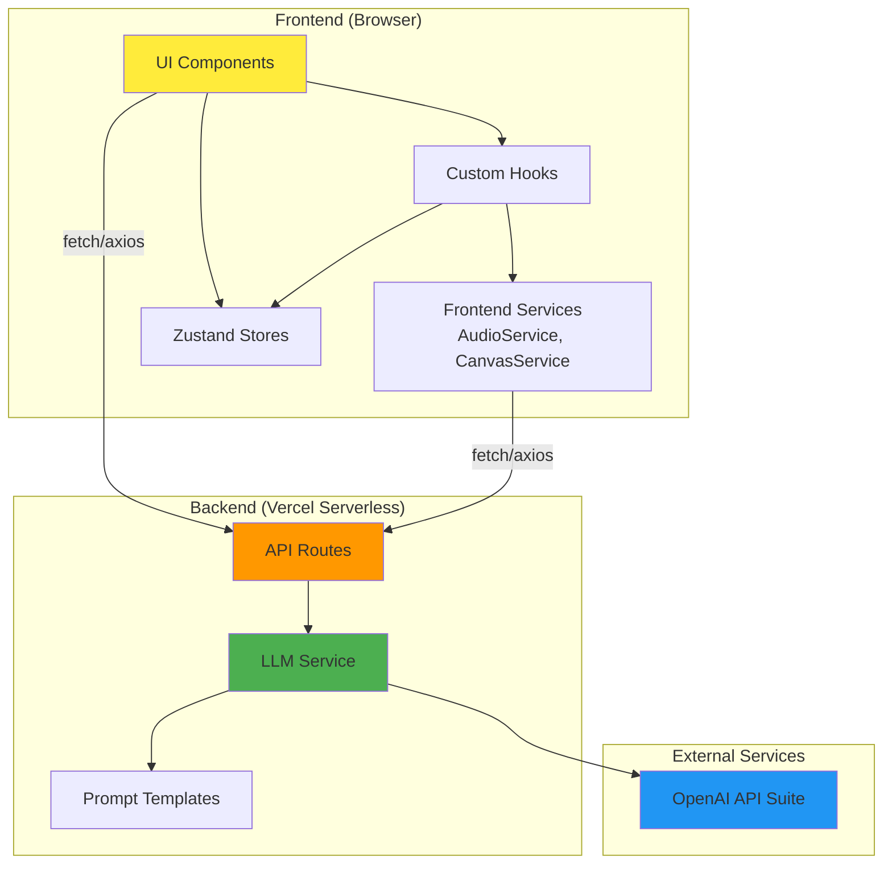

# Components

Based on the architectural patterns, tech stack, and data models, the AI Math Tutor system is organized into **logical components** that span both frontend (React components, hooks, services) and backend (API routes, business logic).

## Frontend Application (Next.js React)

**Responsibility:** User interface rendering, client-side state management, user interaction handling, and API consumption.

**Key Interfaces:**
- Renders tutoring workspace (conversation panel + whiteboard + avatar)
- Manages client state (conversation history, canvas state, UI state)
- Captures user input (text, voice, drawing, image upload)
- Consumes REST API endpoints (`/api/chat`, `/api/tts`, etc.)

**Dependencies:**
- Backend API Routes (via fetch/axios)
- External: Browser APIs (Web Speech API, Canvas API, File API)

**Technology Stack:**
- Next.js 14+ App Router (React 18)
- TypeScript for type safety
- Zustand for state management
- Tailwind CSS for styling
- Konva.js for canvas interaction

## API Orchestration Layer (Next.js API Routes)

**Responsibility:** Server-side request handling, input validation, OpenAI API orchestration, error handling, and response formatting.

**Key Interfaces:**
- Exposes REST endpoints: `/api/chat`, `/api/parse-image`, `/api/generate-problem`, `/api/stt`, `/api/tts`
- Validates incoming requests against TypeScript schemas
- Calls OpenAI APIs with server-side API key
- Formats responses according to API specification
- Handles errors and rate limiting

**Dependencies:**
- Business Logic Services (LLMService, CanvasService, AudioService)
- External: OpenAI API suite

**Technology Stack:**
- Next.js API Routes (serverless functions)
- TypeScript
- OpenAI Node.js SDK

## LLM Service (Socratic Dialogue Engine)

**Responsibility:** Manages all interactions with GPT-4 API for tutoring conversations, including prompt engineering, conversation context management, and function calling for canvas annotations.

**Key Interfaces:**
- `sendMessage(conversationHistory, canvasSnapshot?) → TutorResponse`
- `parseProblemImage(imageBase64) → ParsedProblem`
- `generatePracticeProblem(topic, difficulty?) → MathProblem`

**Dependencies:**
- OpenAI GPT-4 API
- Prompt templates (src/services/prompts.ts)
- Function calling definitions for canvas annotations

**Technology Stack:**
- OpenAI Node.js SDK
- TypeScript

### Prompt Engineering Strategy

The prompts are the "pedagogical intelligence" of the system. They encode teaching methodology, behavioral guidelines, and adaptive scaffolding strategies that transform GPT-4 from a generic chatbot into a Socratic math tutor.

**Prompt Location:** `src/services/prompts.ts`

**Version Control:** All prompts are versioned (e.g., `SOCRATIC_TUTOR_SYSTEM_PROMPT_V1`) to enable A/B testing and iteration.

**Research-Backed Pedagogical Framework:**

1. **Vygotsky's Zone of Proximal Development (ZPD)** - Adaptive scaffolding with 4 escalation levels based on student progress
2. **NCTM's Productive Struggle Principles** - Validates confusion and errors as natural learning processes
3. **Socratic Questioning Framework** - Opening, guiding, and closing questions

**Behavioral Constraints:**
- Ask ONE question at a time
- Acknowledge incorrect answers explicitly
- Celebrate correct steps and partial progress
- Never provide direct answers or complete solutions
- Build incrementally on student's demonstrated understanding

**Visual Annotation Integration:** The prompt instructs GPT-4 to use `annotate_canvas` function sparingly when visual guidance is more effective than verbal.

**Response Format:** 1-3 sentences maximum, age-appropriate vocabulary (grades 3-8), warm conversational tone.

## Canvas Service (Whiteboard Management)

**Responsibility:** Handles canvas state serialization, semantic registry management, and coordinate resolution for tutor annotations.

**Key Interfaces:**
- `serializeCanvas(canvasState) → base64Image`
- `registerSemanticElement(id, boundingBox, label) → void`
- `resolveAnnotationTarget(target: string) → CanvasCoordinates | null`
- `applyAnnotation(action: AnnotationAction) → CanvasAnnotation | null`

**Technology Stack:**
- TypeScript
- Konva.js
- Fuzzy matching algorithm (for semantic target resolution)

**3-Tier Resolution Strategy:**
1. **Semantic Match:** "numerator" → semantic registry lookup
2. **Region Match:** "left side" → predefined region coordinates
3. **Verbal Fallback:** If both fail, return null (tutor's verbal message still displays)

## Audio Service (Voice Interface)

**Responsibility:** Manages browser audio recording (speech-to-text) and playback (text-to-speech), including audio format conversion and error handling.

**Key Interfaces:**
- `startRecording() → void`
- `stopRecording() → AudioBlob`
- `transcribeAudio(audioBlob) → Promise<string>`
- `synthesizeSpeech(text, voice?) → Promise<AudioData>`
- `playAudio(audioData) → void`

**Technology Stack:**
- TypeScript
- Browser Web APIs (MediaRecorder, Audio)

## Component Diagrams

---
