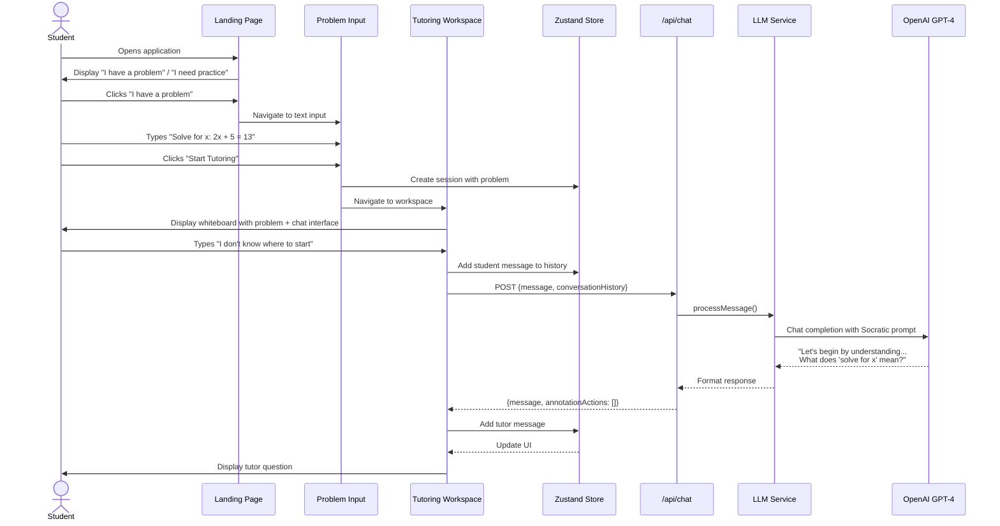
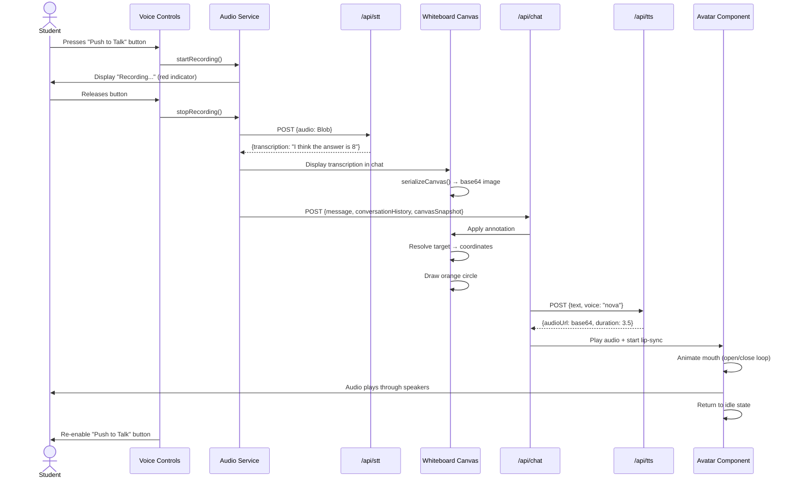

# Core Workflows

This section illustrates critical system workflows using sequence diagrams.

## Workflow 1: Complete Tutoring Session (Text Input Path)

## Workflow 2: Voice Interaction with Canvas Annotation

---
